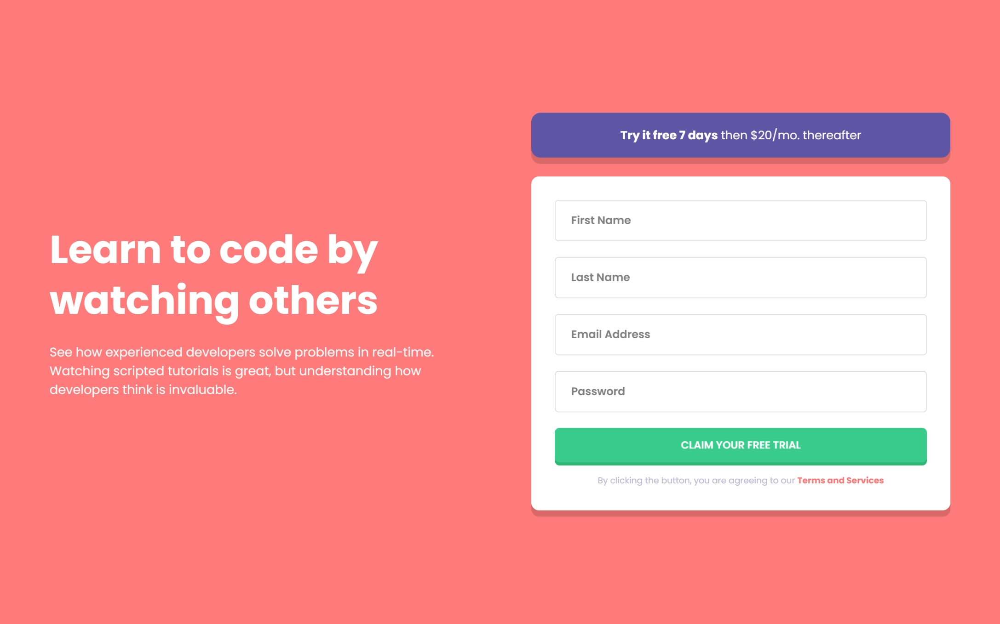

# Frontend Mentor - Intro component with sign up form

Esta é uma solução para o desafio [Intro component with sign up form](https://www.frontendmentor.io/challenges/intro-component-with-signup-form-5cf91bd49edda32581d28fd1)

O objetivo do desafio é construir um layout responsivo com um formulário de cadastro contendo validações e feedback visual para o usuário.

## Sumário

- [Visão geral](#visão-geral)
  - [O desafio](#o-desafio)
  - [Screenshot](#screenshot)
  - [Links](#links)
- [Meu processo](#meu-processo)
  - [Construído com](#construído-com)
  - [Construído com](#construído-com)
- [Autora](#autora)

## Visão geral

### O desafio

Os usuários devem ser capazes de:

- Visualizar o layout ideal de acordo com o tamanho da tela (mobile e desktop)
- Ver estados de hover nos elementos interativos
- Receber mensagens de erro ao enviar o formulário quando:
  - Algum campo estiver vazio
  - O e-mail não estiver em um formato válido
- Receber feedback visual claro em campos inválidos

### Screenshot

### Links

- [Demo](https://jamillyferreira.github.io/frontend-mentor-challenges/faq-accordion/)
- [URL da Solução](https://www.frontendmentor.io/solutions/faq-accordion-responsivo-7hNpM_hFlj)
- [URL do Desafio](https://www.frontendmentor.io/challenges/faq-accordion-wyfFdeBwBz)

---

## Meu processo

### Construído com

- HTML5 semântico
- CSS3 (Mobile-first)
- Flexbox e CSS Grid
- Metodologia BEM para organização das classes
- JavaScript puro (Vanilla JS)
- Validação de formulário com feedback em tempo real
- Atributos ARIA para acessibilidade básica

### O que aprendi

Nesse projeto, pude reforçar vários conceitos importantes de Front-end, como:

- Estruturação de HTML semântico e acessível
- Organização de estilos utilizando CSS custom properties
- Criação de layouts responsivos com abordagem mobile-first
- Validação de formulários com JavaScript puro
- Manipulação do DOM para exibição dinâmica de mensagens de erro
- Uso de `aria-invalid`, `aria-describedby` e boas práticas de acessibilidade
- Separação clara de responsabilidades entre HTML, CSS e JavaScript

## Autora

- Jamilly Ferreira

  - LinkedIn: [Jamilly Ferreira](https://www.linkedin.com/in/jamillyferreira)
  - Instagram: [@dev_jamilly](https://www.instagram.com/dev_jamilly?igsh=bmc4YXAweXNjMzR5)
  - Frontend Mentor: [@jamillyferreira](https://www.frontendmentor.io/profile/jamillyferreira)

---

Este projeto foi desenvolvido como parte dos desafios do Frontend Mentor para praticar e aprimorar habilidades de desenvolvimento front-end.
