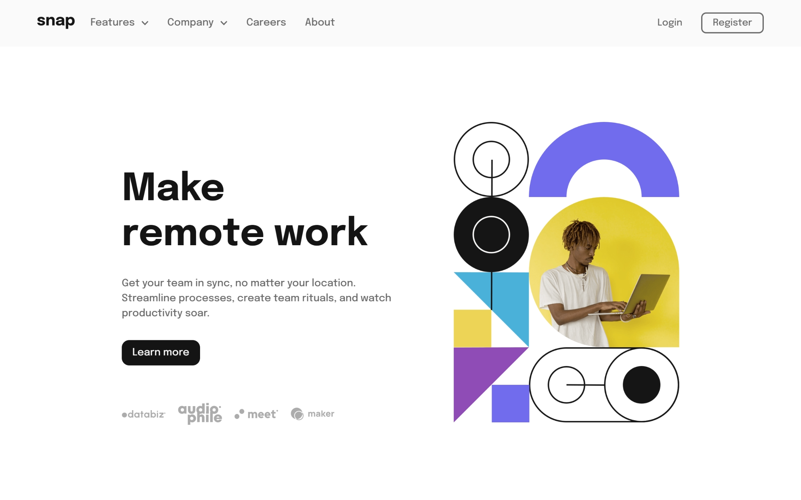

# Frontend Mentor - Intro component with sign up form

Esta é uma solução para o desafio [Intro section with dropdown navigation challenge on Frontend Mentor](https://www.frontendmentor.io/challenges/intro-section-with-dropdown-navigation-ryaPetHE5).

O objetivo do desafio é construir uma landing page com navegação responsiva, contendo menu mobile, submenus interativos e layout adaptável para diferentes tamanhos de tela.

## Sumário

- [Visão geral](#visão-geral)
  - [O desafio](#o-desafio)
  - [Screenshot](#screenshot)
  - [Links](#links)
- [Meu processo](#meu-processo)
  - [Construído com](#construído-com)
  - [O que aprendi](#o-que-aprendi)
- [Autora](#autora)

## Visão geral

### O desafio

Os usuários devem ser capazes de:

- Visualizar o layout ideal de acordo com o tamanho da tela (mobile e desktop)
- Abrir e fechar o menu de navegação no mobile
- Interagir com submenus (“Features” e “Company”)
- Ver animações visuais nos ícones de seta ao abrir os submenus
- Navegar pelo conteúdo principal da landing page de forma clara e acessível

### Screenshot

### Links

- [Demo ao vivo](https://jamillyferreira.github.io/frontend-mentor-challenges/intro-component-with-signup-form/)
- [Repositório](https://github.com/jamillyferreira/frontend-mentor-challenges/tree/main/intro-component-with-signup-form)
- [Solução no Frontend Mentor](https://www.frontendmentor.io/solutions/intro-component-with-signup-form-html-css-and-javascript-qwuewryB19)

---

## Meu processo

### Construído com

- HTML5 semântico
- CSS3 (Mobile-first)
- Flexbox
- JavaScript puro (Vanilla JS)
- Manipulação do DOM
- Controle de estados do menu e submenus

### O que aprendi

Nesse projeto, pude praticar e reforçar conceitos importantes de Front-end, como:

- Estruturação de uma navegação semântica e acessível
- Implementação de menu mobile com overlay
- Criação de submenus interativos controlados via JavaScript
- Manipulação de classes para estados visuais (ativo, rotacionado, aberto)
- Diferença de comportamento entre mobile e desktop usando JavaScript
- Organização de código seguindo boas práticas de separação de responsabilidades

## Autora

- Jamilly Ferreira

  - LinkedIn: [Jamilly Ferreira](https://www.linkedin.com/in/jamillyferreira)
  - Instagram: [@dev_jamilly](https://www.instagram.com/dev_jamilly?igsh=bmc4YXAweXNjMzR5)
  - Frontend Mentor: [@jamillyferreira](https://www.frontendmentor.io/profile/jamillyferreira)

---

Este projeto foi desenvolvido como parte dos desafios do Frontend Mentor para praticar e aprimorar habilidades de desenvolvimento front-end.
