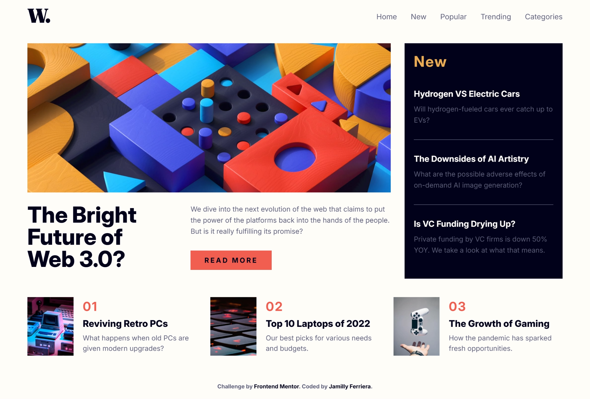

# Frontend Mentor - News homepage solution

Esta é uma solução para o desafio [News homepage](https://www.frontendmentor.io/challenges/news-homepage-H6SWTa1MFl) do Frontend Mentor.

O objetivo do desafio é construir uma landing page de notícias totalmente responsiva, com foco principal na utilização de CSS Grid para organização do layout, além de navegação mobile e boa hierarquia visual.

## Sumário

- [Visão geral](#visão-geral)
  - [O desafio](#o-desafio)
  - [Screenshot](#screenshot)
  - [Links](#links)
- [Meu processo](#meu-processo)
  - [Construído com](#construído-com)
  - [O que aprendi](#o-que-aprendi)
- [Autora](#autora)

## Visão geral

### O desafio

Os usuários devem ser capazes de:

- Visualizar o layout ideal da interface de acordo com o tamanho da tela do seu dispositivo
- Ver os estados de hover e focus em todos os elementos interativos da página

### Screenshot

### Links

- Solution URL: [Add solution URL here](https://your-solution-url.com)
- Live Site URL: [Add live site URL here](https://your-live-site-url.com)

## Meu processo

### Construído com

- HTML5 semântico
- CSS3
- CSS Grid
- Flexbox
- JavaScript(Vanilla JS)

### O que aprendi

Nesse projeto, o foco principal foi praticar e consolidar o uso do CSS Grid em um layout real e mais complexo. Durante o desenvolvimento, pude reforçar conceitos importantes como:

- Criação de layouts complexos utilizando Grid Layout
- Combinação de Grid e Flexbox de forma estratégica
- Organização visual de múltiplas seções em uma homepage
- Controle de navegação mobile com menu lateral e overlay
- Uso de media queries para adaptação em diferentes breakpoints
- Estruturação semântica do HTML para melhor acessibilidade

## Autora

Jamilly Ferreira

- LinkedIn: [Jamilly Ferreira](https://www.linkedin.com/in/jamillyferreira)
- Instagram: [@dev_jamilly](https://www.instagram.com/dev_jamilly?igsh=bmc4YXAweXNjMzR5)
- Frontend Mentor: [@jamillyferreira](https://www.frontendmentor.io/profile/jamillyferreira)

---

Este projeto foi desenvolvido como parte dos desafios do Frontend Mentor para praticar e aprimorar habilidades de desenvolvimento front-end.