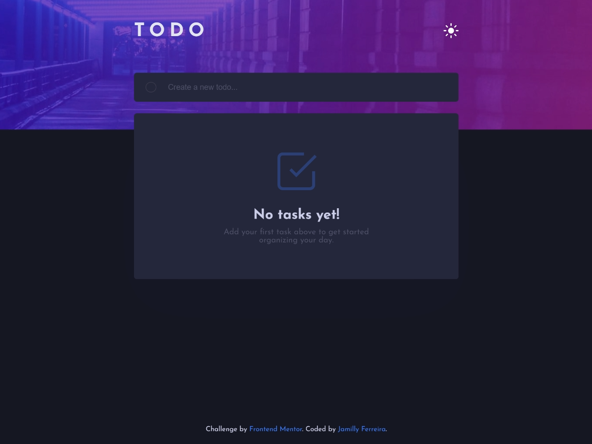

# Frontend Mentor - Todo app

Esta é uma solução para o desafio [Todo app challenge no Frontend Mentor](https://www.frontendmentor.io/challenges/todo-app-Su1_KokOW).

O objetivo deste projeto é desenvolver um Todo App funcional e responsivo utilizando HTML, CSS e JavaScript puro, aplicando boas práticas de organização de código e manipulação de estado no front-end. O projeto também foi pensado para evoluir futuramente com a integração de um backend em Java.

## Sumário

- [Visão geral](#visão-geral)
  - [O desafio](#o-desafio)
  - [Screenshot](#screenshot)
  - [Links](#links)
- [Meu processo](#meu-processo)
  - [Construído com](#construído-com)
  - [O que aprendi](#o-que-aprendi)
  - [Desenvolvimento contínuo](#desenvolvimento-contínuo)
- [Autora](#autora)

---

## Visão geral

### O desafio

Os usuários devem ser capazes de:

- Visualizar o layout ideal da aplicação em diferentes tamanhos de tela
- Ver estados de hover em todos os elementos interativos
- Adicionar novas tarefas à lista
- Marcar tarefas como concluídas
- Remover tarefas da lista
- Filtrar tarefas por:
  - Todas
  - Ativas
  - Concluídas
- Limpar todas as tarefas concluídas
- Alternar entre tema claro e escuro
- **Bônus**: Reordenar tarefas utilizando drag and drop

---

### Screenshot

### Links

- [Demo ao vivo](https://jamillyferreira.github.io/frontend-mentor-challenges/todo-app/)
- [Repositório](https://github.com/jamillyferreira/frontend-mentor-challenges/tree/main/todo-app)
- [Solução no Frontend Mentor](https://www.frontendmentor.io/solutions/todo-app---html-css-and-js-7P0vMtjN3E)

---

## Meu processo

### Construído com

- HTML5 semântico
- CSS custom properties (variáveis CSS)
- Flexbox
- JavaScript (ES6+)
- Manipulação de DOM
- LocalStorage para persistência de dados
- Drag and Drop com biblioteca SortableJS
- Workflow mobile-first

---

### O que aprendi

Nesse projeto, pratiquei e reforcei diversos conceitos importantes de front-end, como:

- Manipulação de estado da aplicação sem frameworks
- Uso do `localStorage` para salvar dados do usuário
- Criação de temas claro e escuro utilizando atributos no `body`
- Filtros dinâmicos e renderização condicional
- Implementação de drag and drop para reordenar itens da lista

---

### Desenvolvimento contínuo

Pretendo continuar evoluindo este projeto nos seguintes pontos:

- Refatoração do JavaScript utilizando ES Modules
- Integração com um backend em Java (Spring Boot)
- Persistência de dados em banco de dados

---

## Autora
Jamilly Ferreira

- LinkedIn: [Jamilly Ferreira](https://www.linkedin.com/in/jamillyferreira)
- Instagram: [@dev_jamilly](https://www.instagram.com/dev_jamilly?igsh=bmc4YXAweXNjMzR5)
- Frontend Mentor: [@jamillyferreira](https://www.frontendmentor.io/profile/jamillyferreira)

---

Este projeto foi desenvolvido como parte dos desafios do Frontend Mentor para praticar e aprimorar habilidades de desenvolvimento front-end.
